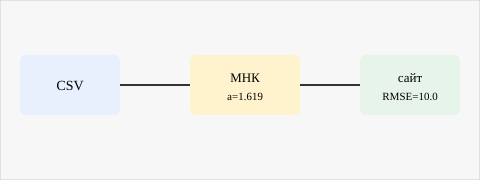
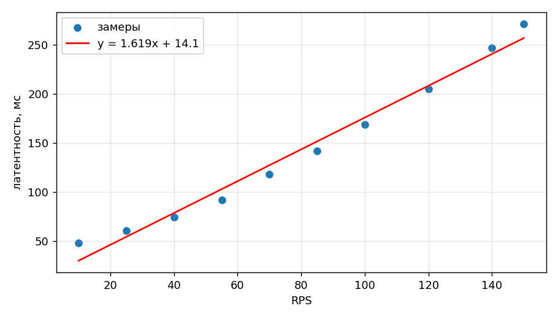

# Результаты

Как снимались точки — в [методике](methods.md#sbor).

--8<-- "generated/build_info.md"

## Модель {#model}

Задержку $L$ при нагрузке $r$ оценивал прямой

$$
\begin{equation}
L(r) = a\, r + b + \varepsilon
\label{eq:latency}
\end{equation}
$$

Коэффициенты в $\eqref{eq:latency}$ — обычный МНК, см. код ниже.
В экспериментальных прогонах сравнивал ещё со скользящим средним;
сглаживанием температурных рядов это не заменить, но для регрессионного
анализа задержки хватило. Латентности в хвосте не смотрел, только среднее.

Для очередей линейная модель грубая, но для публикации сойдёт
[@hastie2009; @kleinrock1975]. Закон Литтла не проверял [@little1961].

## Как это считается

<div class="two-col" markdown>

<div markdown>

Скрипт читает `data/experiment.csv`, считает $a$, $b$ и RMSE,
рисует matplotlib и Plotly. Если вход не менялся — пишет `cache hit`.
Обработка описана [здесь](methods.md#obrabotka).

</div>

<div markdown>



*Рис. 1. csv → расчёт → страница.*

</div>

</div>

## Сводка

<table class="results">
  <caption>Таблица 1. Диапазоны по сериям замеров.</caption>
  <thead>
    <tr>
      <th rowspan="2">Серия</th>
      <th colspan="2">Нагрузка, RPS</th>
      <th colspan="2">Задержка, мс</th>
    </tr>
    <tr>
      <th>min</th>
      <th>max</th>
      <th>min</th>
      <th>max</th>
    </tr>
  </thead>
  <tbody>
    <tr>
      <td rowspan="2">текущий прогон</td>
      <td>10</td>
      <td>85</td>
      <td>48.2</td>
      <td>141.8</td>
    </tr>
    <tr>
      <td>100</td>
      <td>150</td>
      <td>168.7</td>
      <td>271.5</td>
    </tr>
  </tbody>
</table>

Точные $a$ и RMSE после `make experiment` лежат в `docs/generated/summary.csv`.

## Графики



*Рис. 2. Точки и прямая МНК.*

<div class="plotly-wrap">
<iframe src="../generated/latency_plotly.html" title="plotly" height="420"></iframe>
</div>

## Код

```python linenums="1"
def fit(x, y):
    a, b = np.polyfit(x, y, 1)
    rmse = np.sqrt(np.mean((y - a * x - b) ** 2))
    return float(a), float(b), float(rmse)
```

## Шум

$\varepsilon$ считал обычным гауссовским.[^noise]

[^noise]: На живом сервисе смотрел бы ещё 95/99 квантили.

\bibliography
